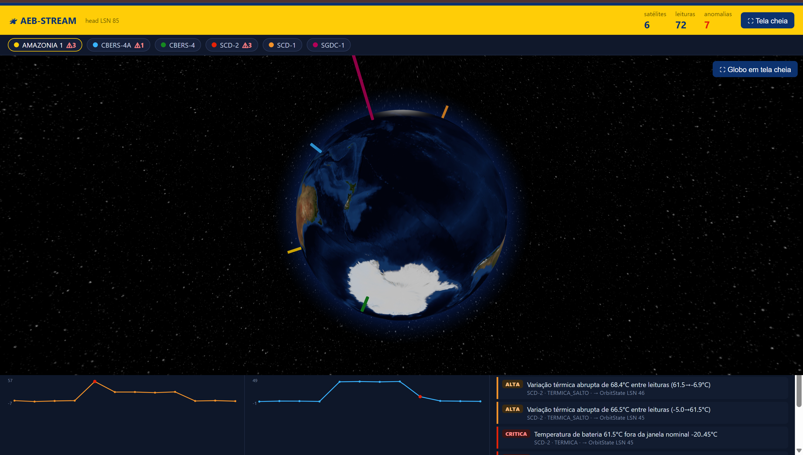

# 🛰️ AEB-STREAM

**Pipeline soberano de ingestão, custódia criptográfica e análise forense de dados
orbitais (TLE) e telemetria de satélites brasileiros** — Agência Espacial Brasileira
(AEB) / Instituto Nacional de Pesquisas Espaciais (INPE).

Construído sobre o **HeraclitusDB** (banco event-sourced, log append-only com Merkle
blake3) e os padrões do framework **LABRA-AGU**.



> Dashboard ao vivo (`python dashboard.py` → http://127.0.0.1:7480): globo 3D com a
> Terra real, as órbitas dos satélites brasileiros por cima, as estações terrenas do
> INPE, os feixes de contacto (hits) e o painel de anomalias detetadas pelo Cérebro.

---

## 🎯 Propósito

Hoje os dados de órbita e telemetria dos satélites brasileiros vivem espalhados por
APIs externas (CelesTrak, Space-Track/EUA) e sistemas isolados do INPE, **sem uma
cadeia de custódia única, imutável e auditável**. Quando há uma anomalia — uma
câmera que aquece fora da janela, uma queda de tensão, uma manobra não prevista —
reconstruir *o que o satélite estava a "sentir" no instante exato da falha* é difícil
e não-reproduzível.

O **AEB-STREAM** resolve isto com três garantias:

1. **Soberania e custódia.** Todo dado orbital/telemetria entra como **evento
   imutável** num log append-only nacional, selado por Merkle (blake3) e carimbo de
   tempo. Nada se edita; corrige-se acrescentando. A proveniência viaja com o dado.

2. **Viagem no tempo forense.** Qualquer estado pode ser consultado **`AS OF LSN X`**
   — "como estavam os sensores no instante anterior à falha?" — de forma
   determinística e reproduzível, anos depois.

3. **Geometria natural dos dados.** A telemetria não é achatada num espaço euclidiano
   plano: cada tipo de dado é indexado na sua **variedade geométrica natural**
   (esférica para órbita, hiperbólica para a hierarquia de hardware, euclidiana para
   métricas contínuas), o que torna a busca por similaridade e a deteção de anomalias
   muito mais fiel à física do problema.

> **Em uma frase:** transformar dados orbitais dispersos numa **caixa-preta nacional
> imutável e consultável no tempo** para operação e perícia de satélites.

---

## 🏗️ Arquitetura — três camadas estritas

```
  CelesTrak / Space-Track / INPE
        (TLE + telemetria)
              │
              ▼
       ┌─────────────┐     append gRPC      ┌──────────────────┐    Subscribe/scan    ┌──────────────────┐
       │ pipeline.py │ ───────────────────► │   HeraclitusDB   │ ───────────────────► │ main.py --daemon │
       │ Os Sentidos │   sph/euc/hyp +      │      O Rio       │   lê o log em lotes  │    O Cérebro     │
       │ ingere s/   │   proveniência       │ log imutável +   │                      │ grafo + ACT-R +  │
       │  opinar     │                      │ Merkle (blake3)  │                      │ alertas anomalia │
       └─────────────┘                      └──────────────────┘                      └──────────────────┘
                                                                                          🔜 (a fazer)
```

| Camada | Papel | Estado |
|---|---|---|
| **Os Sentidos** (`pipeline.py`) | Busca TLE real, propaga (SGP4), projeta para H×S×E e faz *append* gRPC. **Ingere sem opinar.** | ✅ |
| **O Rio** (HeraclitusDB) | Log append-only, event-sourced, Merkle blake3, consultável `AS OF`. | ✅ (externo) |
| **O Cérebro** (`main.py --daemon`) | Lê o log, constrói o grafo temporal, dispara alertas de anomalia (ACT-R). | 🔜 |

A separação é estrita: o pipeline **ingere sem opinar**; o banco **guarda sem
interpretar**; o cérebro **investiga sem tocar nas fontes**. Só se falam pelo rio —
toda interação é um evento imutável com proveniência.

---

## 📐 Fundamentação geométrica — Variedade Produto H × S × E

O HeraclitusDB não opera num espaço euclidiano plano. Mapeia cada dado na sua
geometria natural, numa variedade produto:

$$\mathcal{P} = \mathcal{H}^a(\kappa_1) \times \mathcal{S}^b(\kappa_2) \times \mathcal{E}^c
\qquad
d(x,y)=\sqrt{w_1 d_\mathcal{H}^2 + w_2 d_\mathcal{S}^2 + w_3 d_\mathcal{E}^2}$$

| Espaço | Domínio AEB | Vetor gerado (`agent/orbit.py`) |
|---|---|---|
| **S** — esférico | **Posição orbital**: ponto subsatélite na esfera unitária S² | `[cosφ·cosλ, cosφ·sinλ, sinφ]` (`spherical_vector`) |
| **E** — euclidiano | **Métricas contínuas lineares**: altitude, excentricidade, temperatura, tensão, corrente | `[alt, ecc, n, temp, V, I]` (`euclidean_vector`) |
| **H** — hiperbólico | **Hierarquia de hardware**: `Satelite → Payload → Camera → Sensor` (árvore profunda) | bola de Poincaré, `‖x‖ = profundidade` (`hyperbolic_vector`) |

Os três vetores são enviados no `append` (`sph` / `euc` / `hyp`) e indexados pelo
HeraclitusDB. A magnitude no espaço hiperbólico codifica a **profundidade** do
subsistema na árvore (raiz ≈ origem, folhas → borda), com saturação anti-colapso.

---

## 📂 Estrutura do projeto

```
D:\DEV\AEB\
├── pipeline.py          # Os Sentidos: CelesTrak → HeraclitusDB (222 linhas)
├── consulta.py          # Consultas forenses: AS OF / PROVENANCE / WHY (97 linhas)
├── agent/
│   ├── __init__.py
│   └── orbit.py         # Mecânica orbital + geometria H/S/E (218 linhas)
├── requirements.txt     # requests, sgp4, grpcio
└── README.md            # este ficheiro
```

### `agent/orbit.py` — Mecânica orbital e geometria
Núcleo matemático, sem dependências pesadas (só `sgp4`):

| Símbolo | Função |
|---|---|
| `OrbitalElements` | dataclass com os elementos médios do TLE (+ `semi_major_axis_km`, `period_min`) |
| `SubPoint` | posição subsatélite num instante (lat/lon/alt + vetor TEME) |
| `parse_tle(l1, l2)` | extrai elementos do formato de colunas fixas do TLE |
| `propagate(l1, l2, when)` | **SGP4** → posição TEME → geodésico |
| `_teme_to_geodetic(r, jd, fr)` | TEME → ECEF (GMST) → lat/lon/alt **WGS84** (iteração de Bowring) |
| `_gmst_rad(jd, fr)` | tempo sideral de Greenwich (IAU 1982) |
| `spherical_vector` / `euclidean_vector` / `hyperbolic_vector` | projeção para S / E / H |

### `pipeline.py` — Ingestão
| Função | Papel |
|---|---|
| `SATELITES_BR` | catálogo NORAD dos satélites brasileiros |
| `fetch_tle(catnr)` | busca TLE na CelesTrak (com fallback de URL, retries + backoff) |
| `simular_telemetria(el, sub)` | telemetria plausível (temp varia com eclipse) — *substituir por feed real* |
| `ensure_satelite(client, el)` | garante o nó-raiz `Satelite` (idempotente por CATNR), devolve ULID |
| `append_orbit_state(...)` | grava o evento `OrbitState` com `sph`/`euc`/`hyp` + **parent ULID** |
| `ingerir_satelite(...)` | pipeline completo: fetch → parse → propaga → append |

### `consulta.py` — Análise forense
| Função | Operador HeraclitusDB |
|---|---|
| `estado_antes_de(client, lsn, catnr)` | **`AS OF LSN`** — estado dos sensores antes da falha |
| `proveniencia(client, event_id)` | **`PROVENANCE`** — cadeia de custódia |
| `porque(client, event_id, k)` | **`WHY`** — cadeia causal mínima de um alerta |

---

## 🧬 Schema do evento (event-sourcing)

A realidade primária é o evento imutável. Dois kinds:

**`Satelite`** (nó-raiz da hierarquia de hardware, 1 por CATNR):
```jsonc
{
  "id": "01KVQWF3CE…",            // ULID gerado pelo banco
  "kind": "Satelite",
  "attrs": { "catnr": "47699", "nome": "AMAZONIA-1", "inclinacao_deg": "98.4313",
             "periodo_min": "99.90", "semi_eixo_km": "7133.9", "agencia": "AEB/INPE" },
  "hyp":   [ /* embutimento hiperbólico, depth=0 */ ]
}
```

**`OrbitState`** (telemetria + órbita num instante; aponta para o `Satelite`):
```jsonc
{
  "id": "01KVQWF3F7…",
  "kind": "OrbitState",
  "parents": ["01KVQWF3CE…"],     // proveniência → Satelite (ULID)
  "attrs": { "satellite_id": "AMAZONIA-1", "ts": "2026-06-22T…",
             "latitude": "-9.68402", "longitude": "-66.43513", "altitude_km": "758.53",
             "battery_temp": "23.56", "solar_voltage": "48.62", "eclipse": "False" },
  "sph": [ /* S² */ ], "euc": [ /* métricas */ ], "hyp": [ /* hierarquia */ ]
}
```

---

## 📡 Fontes de dados (reais, públicas)

| Fonte | Uso | Auth | Estado |
|---|---|---|---|
| **CelesTrak GP API** | TLE de satélites (`gp.php?CATNR=47699&FORMAT=TLE`) | não | ✅ |
| **Space-Track** (NORAD/EUA) | catálogo completo + detritos | conta gratuita | 🔜 |
| **INPE / CDSR** | catálogo de imagens e metadados | — | 🔜 |
| **INPE / CRC** | passagens e rastreio | — | 🔜 |

Catálogo BR incluído: Amazonia-1 (47699), CBERS-4A (44883), CBERS-4 (40336),
SCD-1 (22490), SCD-2 (25504), SGDC-1 (43226).

---

## 🚀 Instalação e uso

```bash
pip install -r requirements.txt          # requests, sgp4, grpcio
# (HeraclitusDB a correr em 127.0.0.1:7474)

# Ingestão
python pipeline.py --dry-run             # busca+parse, NÃO grava (validação)
python pipeline.py --catnr 47699 --once  # ingere Amazonia-1, um ciclo
python pipeline.py --grupo --interval 60 # catálogo BR, streaming a cada 60s

# Consultas forenses
python consulta.py asof 4641814 --catnr 47699   # estado antes da falha
python consulta.py prov <event_id>              # cadeia de custódia
python consulta.py why  <event_id>              # cadeia causal de um alerta
```

---

## ✅ Validação (dados reais)

Testado com o TLE real do **Amazonia-1** (CelesTrak):

```
agent/orbit.py : inc=98.43° (heliossíncrona ✓)  alt=755 km (nominal 752 km ✓)  período=99.9 min ✓
pipeline.py    : Satelite 01KVQWF3CE… + OrbitState LSN 4641814
                 parents=[01KVQWF3CE…]  ← proveniência por ULID ✓
                 vetores S/E/H indexados ✓
consulta.py    : AS OF LSN → estado pré-falha ✓   PROVENANCE → cadeia de custódia ✓
```

---

## 🗺️ Roadmap

- ✅ **Os Sentidos** — `orbit.py` (TLE+SGP4+geometria), `pipeline.py` (CelesTrak→banco), `consulta.py` (AS OF/PROVENANCE/WHY).
- 🔜 **O Cérebro** — `agent/graph.py` (grafo temporal órbita+hardware), `agent/act_r.py` (ativação ACT-R: *boost* em sensores fora da janela nominal), `main.py --daemon` (deteção de anomalias térmicas/elétricas e manobras).
- 🔜 **Resiliência** — cache local de TLE (evita martelar a CelesTrak / suporte offline).
- 🔜 **Mais fontes** — Space-Track (auth), INPE/CDSR (catálogo), CRC (passagens).
- 🔜 **Instância dedicada** do HeraclitusDB para a AEB (data dir/porta próprios).

---

## ⚠️ Notas técnicas

- **Telemetria simulada:** `simular_telemetria` gera leituras plausíveis para a PoC;
  num sistema real, ligar ao feed da estação terrena.
- **CelesTrak rate-limit:** a API por vezes dá *timeout*; o `fetch_tle` trata com
  retries + backoff. Um cache de TLE está no roadmap.
- **Instância partilhada (PoC):** os nós AEB foram, nesta prova, para a mesma
  instância do HeraclitusDB usada noutros domínios; produção deve usar instância
  dedicada.
- **SGP4 + WGS84:** a conversão TEME→geodésico ignora nutação/movimento polar
  (termos pequenos) — adequado para PoC; refinar com correções IAU se precisar de
  precisão sub-km absoluta.

---

*Desenvolvido sobre HeraclitusDB (o Rio) + padrões LABRA-AGU. Domínio: AEB/INPE.*
